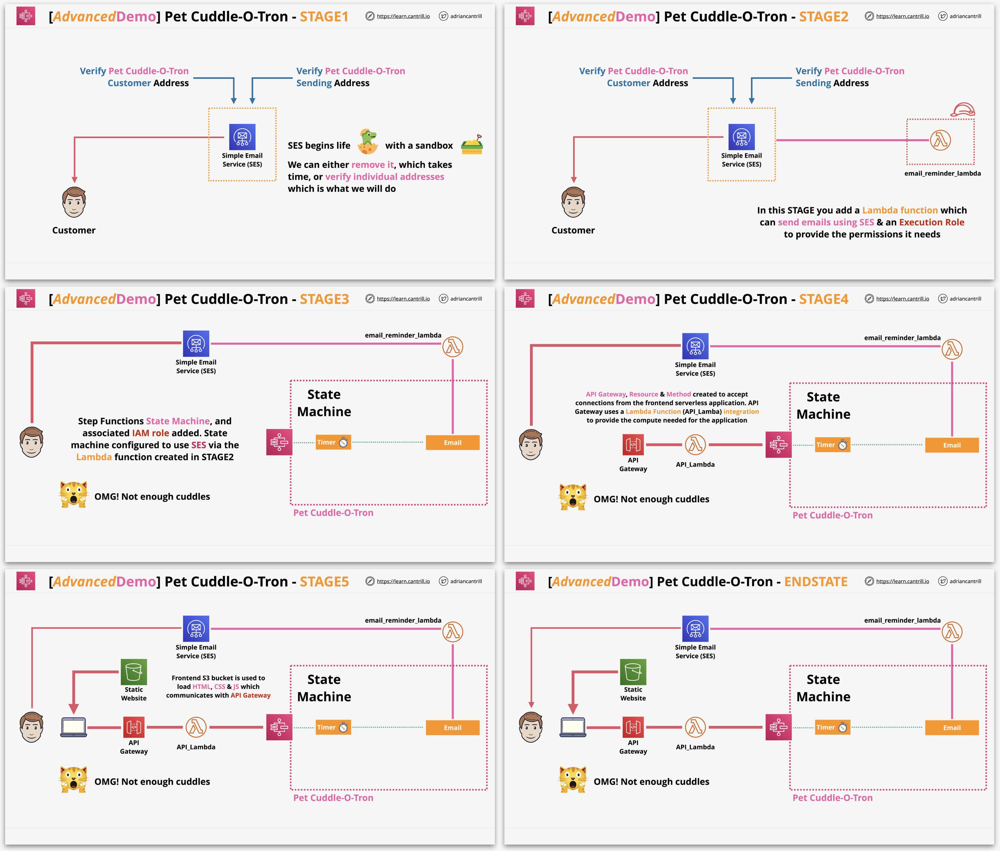
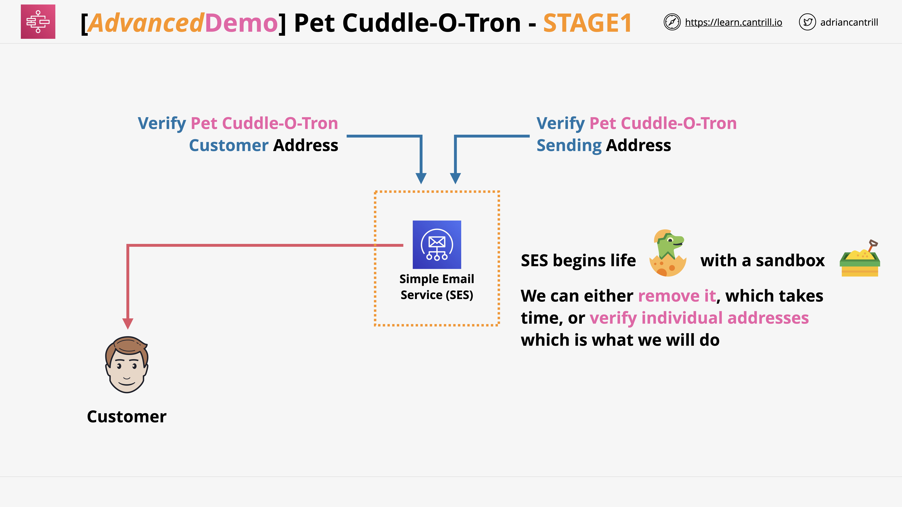
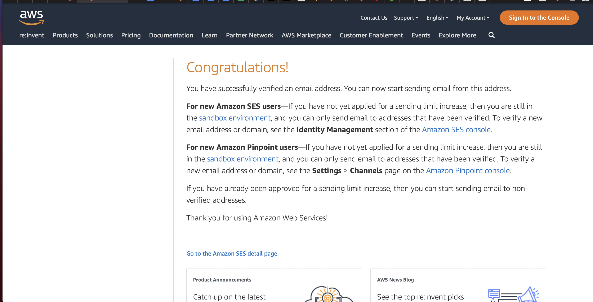
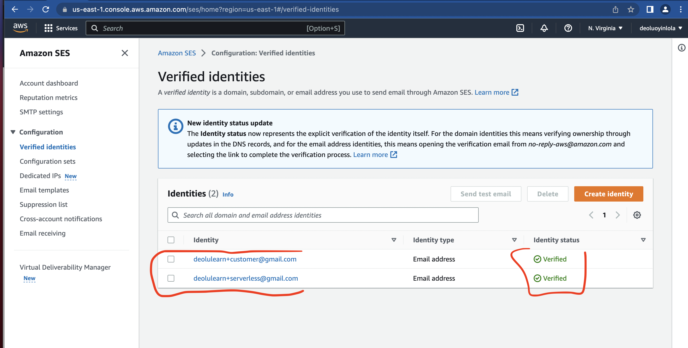
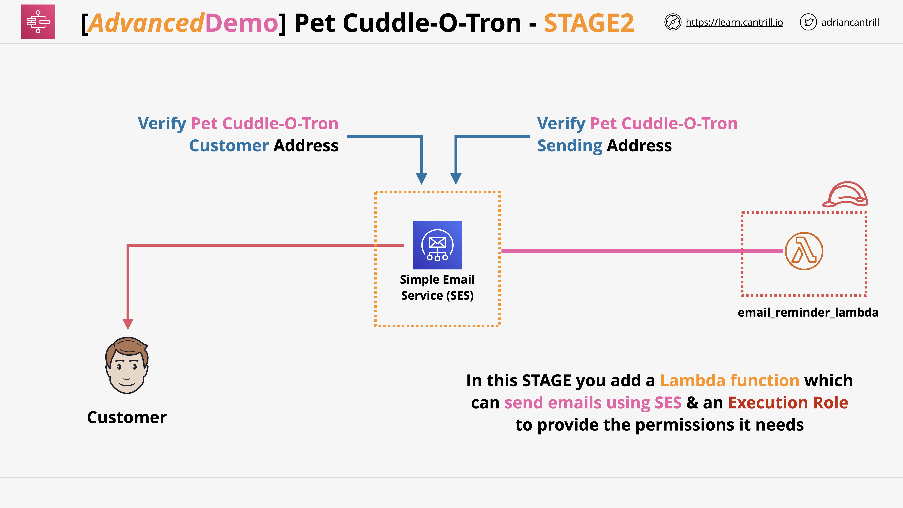
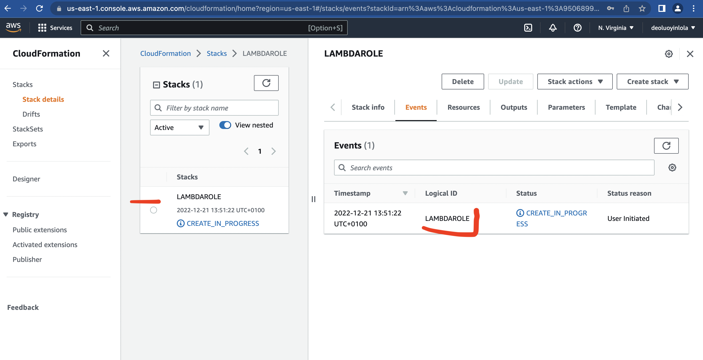
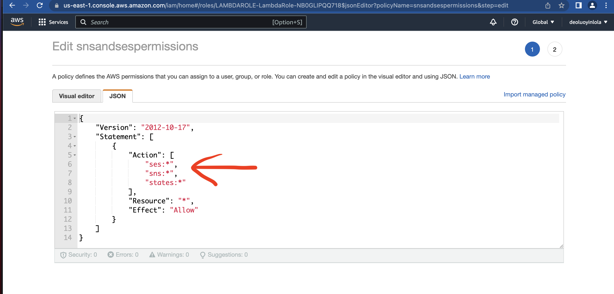
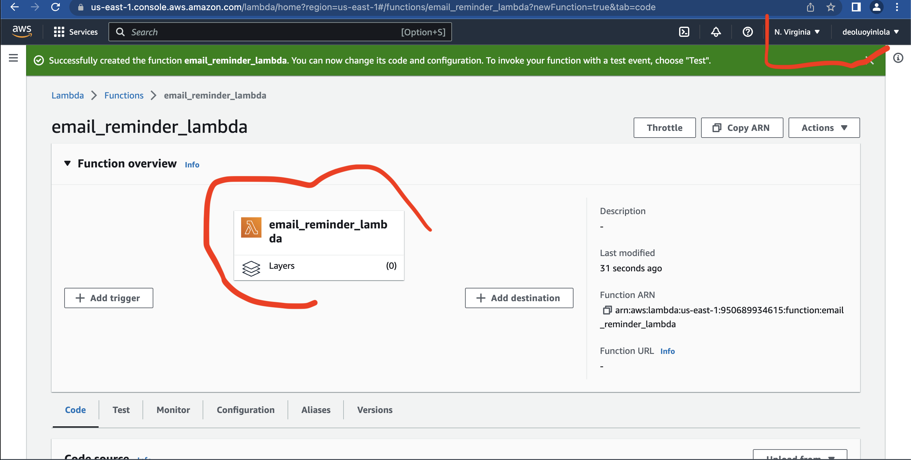
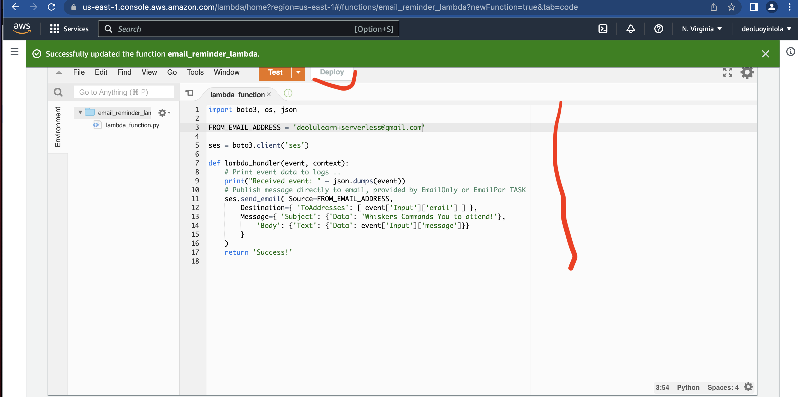

# aws-serverless-app

* [Description](#description)
* [Pre-requisites](#pre-requisities)
* [Configure Simple Email service](#Configure-simple-email-service)
* [Add a email lambda function](#Add-a-email-lambda-function)
* [Implement and configure the state machine](#Implement-and-configure-the-state-machine)
* [Implement the API Gateway](#Implement-the-API-Gateway)
* [Implement the static frontend application](#Implement-the-static-frontend-application)
* [Cleanup the account](#Cleanup-the-account)

## Description
 The application will load from an S3 bucket and run in browser, communicating with Lambda and Step functions via an API Gateway Endpoint Using the application you will be able to configure reminders for 'the app' to be sent using email. I have section this project into 6 stages and is pattern after Adrian Cantrill serverless project.
 

## Pre-requisites
- [aws](https://aws.amazon.com/) - cloud platform, offers reliable, scalable, and inexpensive cloud computing services.

## Configure Simple Email service

- Step 1; Verify SES application sending email address;
The application is going to send reminder messages via SMS and Email. It will use the SES. In production, it could be configured to allow sending from the application email, to any users of the application.

Ensure you are logged into an AWS account, have admin privileges and are in the us-east-1 / N. Virginia Region.
Move to the `SES` console https://console.aws.amazon.com/ses/home?region=us-east-1#.

Click on `Verified Identities` under Configuration Click `Create Identity`. Check the `'Email Address'` checkbox. Ideally you will need a sending email address for the application and a receiving email address for your test customer. But you can use the same email for both.

For my application email, the email the app will send from i'm going to use deolulearn+serverless@gmail.com.

Click `Create Identity`. You will receive an email to this address containing a link to click. Click that link, you should received a `Congratulations!` message. Return to the SES console and `Refresh` your browser, the verification status should now be `verified`
Record this address somewhere save as the `Serverless Sending Address`

- Step 2; Verify SES application customer email address;
If you want to use a different email address for the test customer (recommended), follow the steps below;

Click `Create Identity`. Check the `'Email Address'` checkbox for my application email. The email for my test customer is  deolulearn+customer@gmail.com.
Click `Create Identity`. You will receive an email to this address containing a link to click. Click that link
You should see a `Congratulations!` message. Return to the SES console and refresh your browser, the verification status should now be `verified`. Record this address somewhere save as the `Serverless Customer Address`

At this point we have whitelisted 2 email addresses for use with SES.

the `Serverless Sending Address`.
the `Serverless Customer Address`.



## Add a email lambda function

- Step 1; Create the lambda execution Role for lambda;
We need to create an IAM role which the email_reminder_lambda will use to interact with other AWS services.


Make sure it provides SES, SNS and Logging permissions to whatever assumes this role.


- Step 2; Create the email_reminder_lambda function;
Here, we're going to create the lambda function which will will be used by the serverless application to create an email and then send it using SES.
Move to the lambda console https://console.aws.amazon.com/lambda/home?region=us-east-1#/functions.
Click on Create Function.
Select Author from scratch.
For Function name enter `email_reminder_lambda` and for runtime click the dropdown and pick Python 3.9.
Expand Change default execution role.
Pick to Use an existing Role.
Click the Existing Role dropdown and pick LambdaRole (there will be randomness and thats ok).
Click Create Function


- Step 3; Configure the email_reminder_lambda function;
Scroll down, to Function code in the lambda_function code box, select all the code and delete it.
Replace with this code;
```
import boto3, os, json

FROM_EMAIL_ADDRESS = 'REPLACE_ME'

ses = boto3.client('ses')

def lambda_handler(event, context):
    # Print event data to logs .. 
    print("Received event: " + json.dumps(event))
    # Publish message directly to email, provided by EmailOnly or EmailPar TASK
    ses.send_email( Source=FROM_EMAIL_ADDRESS,
        Destination={ 'ToAddresses': [ event['Input']['email'] ] }, 
        Message={ 'Subject': {'Data': 'Whiskers Commands You to attend!'},
            'Body': {'Text': {'Data': event['Input']['message']}}
        }
    )
    return 'Success!'
  ```

This function will send an email to an address it's supplied with (by step functions) and it will be FROM the email address we specify.
Select `REPLACE_ME` and replace with the Serverless Sending Address which you noted down in STAGE1.
Click Deploy to configure the lambda function.
Scroll all the way to the top, and click the copy icon next to the lambda function ARN.
Note this ARN down somewhere same as the email_reminder_lambda ARN.



## Implement and configure the state machine

## Implement the static frontend application

## Cleanup the account