# aws-serverless-app
## Description
The application will load from an S3 bucket and run in browser, communicating with Lambda and Step functions via an API Gateway Endpoint Using the application you will be able to configure reminders for 'the app' to be sent using email. I have section this project into 6 steps and is replicas of Adrian Cantrill serverless project, [Original project link](https://github.com/acantril/learn-cantrill-io-labs)


* [Description](#description)
* [Pre-requisites](#pre-requisities)
* [Configure Simple Email service](#Configure-simple-email-service)
* [Add a email lambda function](#Add-a-email-lambda-function)
* [Implement and configure the state machine](#Implement-and-configure-the-state-machine)
* [Implement the API Gateway](#Implement-the-API-Gateway)
* [Implement the static frontend application](#Implement-the-static-frontend-application)
* [Cleanup the account](#Cleanup-the-account)

## Pre-requisites
- [aws](https://aws.amazon.com/) - cloud platform, offers reliable, scalable, and inexpensive cloud computing services.

## Configure Simple Email service

- Step 1; Verify SES application sending email address;
The application is going to send reminder messages via SMS and Email. It will use the SES. In production, it could be configured to allow sending from the application email, to any users of the application.

Ensure you are logged into an AWS account, have admin privileges and are in the us-east-1 / N. Virginia Region.
Move to the `SES` console https://console.aws.amazon.com/ses/home?region=us-east-1#.

Click on `Verified Identities` under Configuration Click `Create Identity`. Check the `'Email Address'` checkbox. Ideally you will need a sending email address for the application and a receiving email address for your test customer. But you can use the same email for both.

For my application email, the email the app will send from i'm going to use deolulearn+serverless@gmail.com.

Click `Create Identity`. You will receive an email to this address containing a link to click. Click that link, you should received a `Congratulations!` message. Return to the SES console and `Refresh` your browser, the verification status should now be `verified`
Record this address somewhere save as the `Serverless Sending Address`

- Step 2; Verify SES application customer email address;
If you want to use a different email address for the test customer (recommended), follow the steps below;

Click `Create Identity`. Check the `'Email Address'` checkbox for my application email. The email for my test customer is  deolulearn+customer@gmail.com.
Click `Create Identity`. You will receive an email to this address containing a link to click. Click that link
You should see a `Congratulations!` message. Return to the SES console and refresh your browser, the verification status should now be `verified`. Record this address somewhere save as the `Serverless Customer Address`

At this point we have whitelisted 2 email addresses for use with SES.

the `Serverless Sending Address`.
the `Serverless Customer Address`.


## Add a email lambda function

- Step 1; Create the lambda execution Role for lambda;
We need to create an IAM role which the email_reminder_lambda will use to interact with other AWS services.


Make sure it provides SES, SNS and Logging permissions to whatever assumes this role.


- Step 2; Create the email_reminder_lambda function;
Here, we're going to create the lambda function which will will be used by the serverless application to create an email and then send it using SES.
Move to the lambda console https://console.aws.amazon.com/lambda/home?region=us-east-1#/functions.
Click on Create Function.
Select Author from scratch.
For Function name enter `email_reminder_lambda` and for runtime click the dropdown and pick Python 3.9.
Expand Change default execution role.
Pick to Use an existing Role.
Click the Existing Role dropdown and pick LambdaRole (there will be randomness and thats ok).
Click Create Function


- Step 3; Configure the email_reminder_lambda function;
Scroll down, to Function code in the lambda_function code box, select all the code and delete it.
Replace with this code;
```
import boto3, os, json

FROM_EMAIL_ADDRESS = 'REPLACE_ME'

ses = boto3.client('ses')

def lambda_handler(event, context):
    # Print event data to logs .. 
    print("Received event: " + json.dumps(event))
    # Publish message directly to email, provided by EmailOnly or EmailPar TASK
    ses.send_email( Source=FROM_EMAIL_ADDRESS,
        Destination={ 'ToAddresses': [ event['Input']['email'] ] }, 
        Message={ 'Subject': {'Data': 'Whiskers Commands You to attend!'},
            'Body': {'Text': {'Data': event['Input']['message']}}
        }
    )
    return 'Success!'
  ```

This function will send an email to an address it's supplied with (by step functions) and it will be FROM the email address we specify.
Select `REPLACE_ME` and replace with the Serverless Sending Address which you noted down in STAGE1.
Click Deploy to configure the lambda function.
Scroll all the way to the top, and click the copy icon next to the lambda function ARN.
Note this ARN down somewhere same as the email_reminder_lambda ARN.


## Implement and configure the state machine
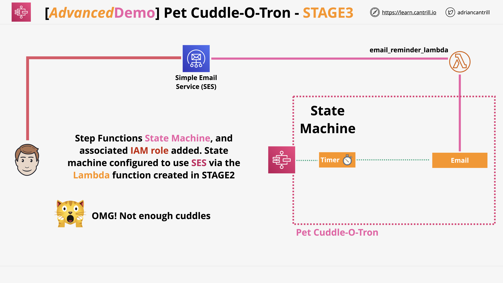
Here, we need to create an IAM role which the state machine will use to interact with other AWS services.
- Step 1; Create State Machine Role
- We can create this manually, but its easier to do this step using cloudformation to speed things up. Write its configuration code, Check the I acknowledge that AWS CloudFormation might create IAM resources. box and then click Create Stack.
- Wait for the Stack to move into the `CREATE_COMPLETE` state before moving into the next.
Move to the IAM Console https://console.aws.amazon.com/iam/home?#/roles and review the STATE MACHINE role note how it gives

- logging permissions
- the ability to invoke the email lambda function when it needs to send emails
- the ability to use SNS to send text messages
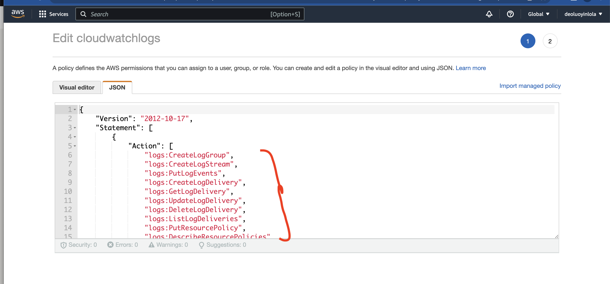

- step 2; Create State Machine
Move to the AWS Step Functions Console https://console.aws.amazon.com/states/home?region=us-east-1#/homepage  
Click the `Hamburger Menu` at the top left and click `State Machines`  
Click `Create State Machine`  
Select `Write your workflow in code` which will allow you to use Amazon States Language  
Scroll down
for `type` select `standard`  
Open this in a new tab https://learn-cantrill-labs.s3.amazonaws.com/aws-serverless-pet-cuddle-o-tron/pet-cuddle-o-tron.json  
this is the Amazon States Language (ASL) file for the `pet-cuddle-o-tron` state machine  
Copy the contents into your clipboard   
Move back to the step functions console   
Select all of the code snippet and delete it  
Paste in your clipboard  

Click the `Refresh` icon on the right side area ... next to the visual map of the state machine.  
Look through the visual overview and the ASL .. and make sure you understand the flow through the state machine.  

The state machine starts ... and then waits for a certain time period based on the `Timer` state. This is controlled by the web front end you will deploy soon. Then the `email` is used Which sends an email reminder

The state machine will control the flow through the serverless application.. once stated it will coordinate other AWS services as required.

- step 3; Configure State Machine
In the state machine ASL (the code on the left) locate the `EmailOnly` definition.  
Look for `EMAIL_LAMBDA_ARN` which is a placeholder, replace this with the email_reminder_lambda ARN you noted down in the previous step. This is the ARN of the lambda function you created.

Scroll down to the bottom and click `next` 
For `State machine name` use `PetCuddleOTron`  
Scroll down and under `Permissions` select `Choose an existing role` and select `StateMachineRole` from the dropdown (it should be the only one, if you have multiple select the correct one and there will be random which is fine as this was created by CloudFormation)
Scroll down, under `Logging`, change the `Log Level` to `All`  
Scroll down to the bottom and click `Create state machine`  

Locate the `ARN` for the state machine on the top left... note this down somewhere safe as `State Machine ARN`

Here, we have configured the state machine which is the core part of the serverless application.  
The state machine controls the flow through the application and is responsible for interacting with other AWS products and services.


## Implement the API Gateway
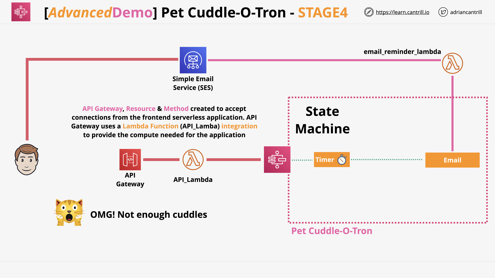
In this stage we will be creating the front end API for the serverless application.  
The front end loads from S3, runs in your browser and communicates with this API.  
It uses API Gateway for the API Endpoint, and this uses Lambda to provide the backing compute.  
First you will create the supporting `API_LAMBDA` and then the `API Gateway`  

- step 1; CREATE API LAMBDA FUNCTION WHICH SUPPORTS API GATEWAY

Move to the Lambda console https://console.aws.amazon.com/lambda/home?region=us-east-1#/functions  


Click on `Create Function`  
for `Function Name` use `api_lambda`  
for `Runtime` use `Python 3.9`  
Expand `Change default execution role`  
Select `Use an existing role`  
Choose the `LambdaRole` from the dropdown  
Click `Create Function`  
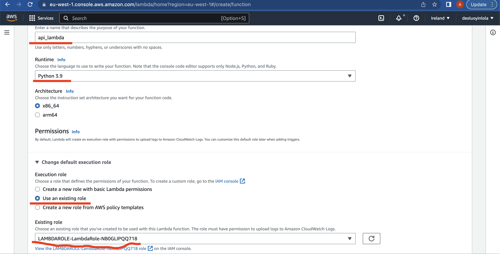

This is the lambda function which will support the API Gateway

- step 2; CONFIGURE THE LAMBDA FUNCTION (Using the current UI)

Scroll down, and remove all the code from the `lambda_function` text box  
Open the api_lambda.py from the Docs dir.
Move back to the Lambda console.  
Select the existing lambda code and delete it.  
Paste the code into the lambda fuction.  

This is the function which will provide compute to API Gateway.  
It's job is to be called by API Gateway when its used by the serverless front end part of the application (loaded by S3)
It accepts some information from you, via API Gateway and then it starts a state machine execution - which is the logic of the application.  

You need to locate the `YOUR_STATEMACHINE_ARN` placeholder and replace this with the State Machine ARN you noted down in the previous step.  
Click `Deploy` to save the lambda function and configuration.     
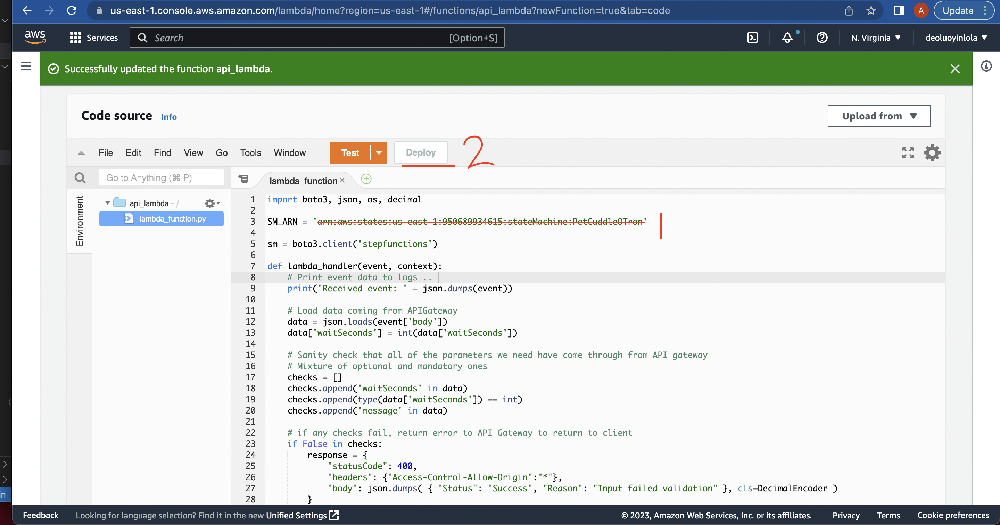
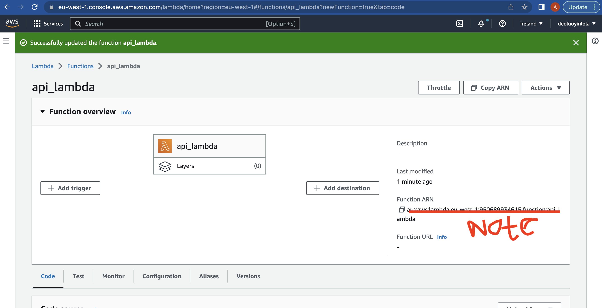

- step 3; CREATE API

Now we have the api_lambda function created, the next step is to create the API Gateway, API and Method which the front end part of the serverless application will communicate with.  
Move to the API Gateway console https://console.aws.amazon.com/apigateway/main/apis?region=us-east-1  
Click `APIs` on the menu on the left  
Locate the `REST API` box, and click `Build` (being careful not to click the build button for any of the other types of API ... REST API is the one you need)
If you see a popup dialog `Create your first API` dismiss it by clicking `OK`  
Under `Create new API` ensure `New API` is selected.  

For `API name*` enter `petcuddleotron`  
for `Endpoint Type` pick `Regional` 
Click `create API`  

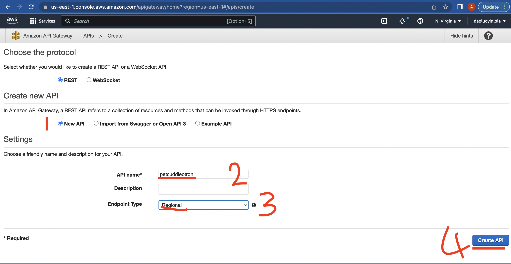

- step 4; CREATE RESOURCE

Click the `Actions` dropdown and Click `Create Resource`  
Under resource name enter `petcuddleotron`  
make sure that `Configure as proxy resource` is **NOT** ticked - this forwards everything as is, through to a lambda function, because we want some control, we **DONT** want this ticked.  
Towards the bottom **MAKE SURE TO TICK** `Enable API Gateway CORS`.  
This relaxes the restrictions on things calling on our API with a different DNS name, it allows the code loaded from the S3 bucket to call the API gateway endpoint.  
**if you DONT check this box, the API will fail**   
Click `Create Resource`  

- step 5; CREATE METHOD

Ensure you have the `/petcuddleotron` resource selected, click `Actions` dropdown and click `create method`  
In the small dropdown box which appears below `/petcuddleotron` select `POST` and click the `tick` symbol next to it.  
this method is what the front end part of the application will make calls to.  
Its what the api_lambda will provide services for.  

Ensure for `Integration Type` that `Lambda Function` is selected.  
Make sure `us-east-1` is selected for `Lambda Region`  
In the `Lambda Function` box.. start typing `api_lambda` and it should autocomplete, click this auto complete (**Make sure you pick api_lambda and not email reminder lambda**)  

Make sure that `Use Default Timeout` box **IS** ticked.  
Make sure that `Use Lambda Proxy integration` box **IS** ticked, this makes sure that all of the information provided to this API is sent on to lambda for processing in the `event` data structure.  
**if you don't tick this box, the API will fail**  
Click `Save`  
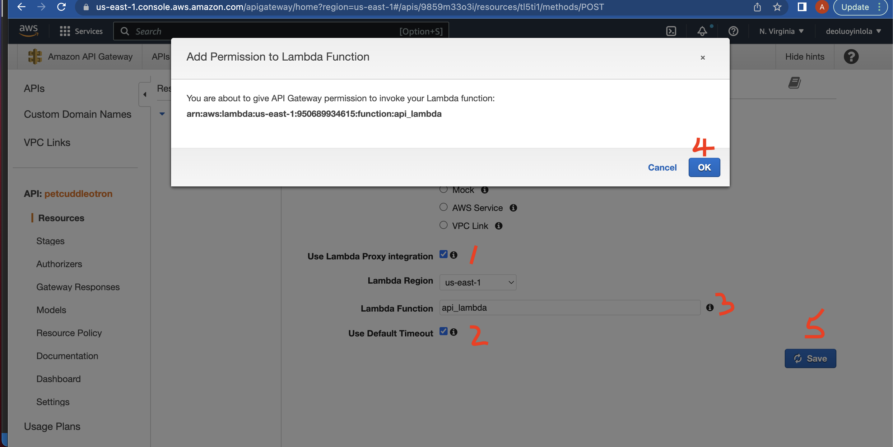
You may see a dialogue stating `You are about to give API Gateway permission to invoke your Lambda function:`. AWS is asking for your OK to adjust the `resource policy` on the lambda function to allow API Gateway to invoke it.  This is a different policy to the `execution role policy` which controls the permissions lambda gets.  
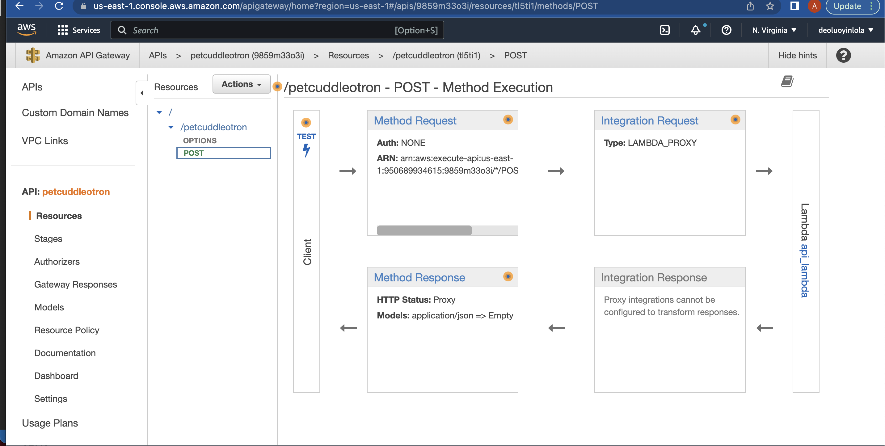


- step 6; DEPLOY API  

Now the API, Resource and Method are configured - you now need to deploy the API out to API gateway, specifically an API Gateway STAGE.  
Click `Actions` Dropdown and `Deploy API`  
For `Deployment Stage` select `New Stage`  
for stage name and stage description enter `prod`  
Click `Deploy`  

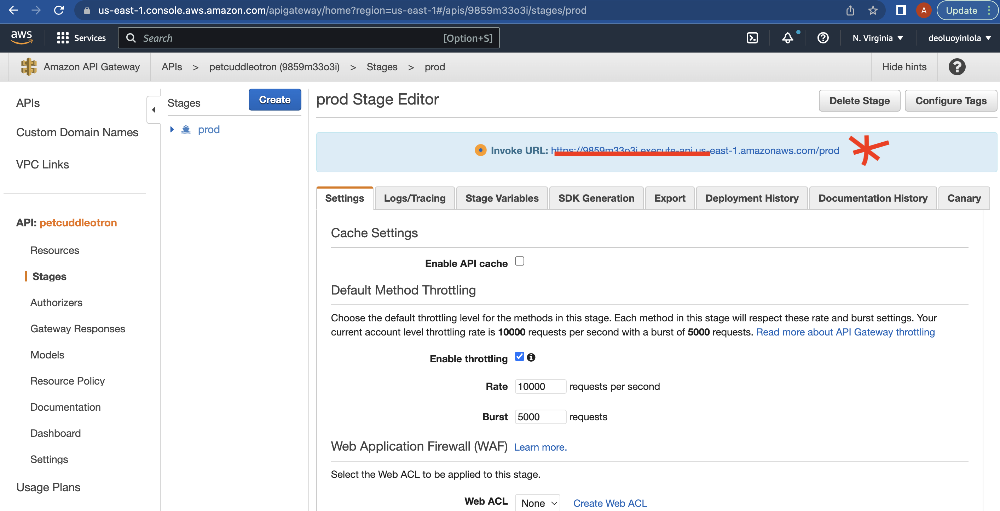

At the top of the screen will be an `Invoke URL` .. note this down somewhere safe, you will need it in the next STAGE.  
This URL will be used by the client side component of the serverless application and this will be unique to you.    


- FINISH

At this point you have configured the last part of the AWS side of the serveless application.   
You now have :-

- SES Configured
- An Email Lambda function to send email using SES
- A State Machine configured which can send EMAIL after a certain time period when invoked.
- An API, Resource & Method, which use a lambda function for backing deployed out to the PROD stage of API Gateway


## Implement the static frontend application
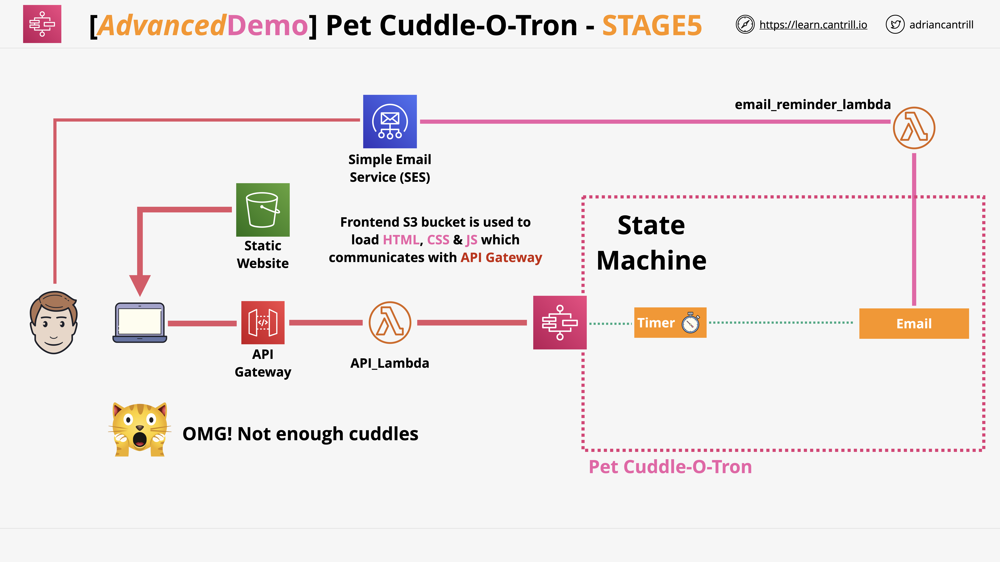
In this stage of the application you will create an S3 bucket and static website hosting which will host the application front end.  
You will download the source files for the front end, configure them to connect to your specific API gateway and then upload them to S3.
Finally, you will run some application tests to verify its functionality.

- step 1; CREATE THE S3 BUCKET

Move to the S3 Console https://s3.console.aws.amazon.com/s3/home?region=us-east-1#
Click `Create bucket`  
Choose a unique bucket name
Ensure the region is set to `US East (N.Virginia) us-east-1`  
Scroll Down and **UNTICK** `Block all public access`  
Tick the box under `Turning off block all public access might result in this bucket and the objects within becoming public` to acknowledge you understand that you can make the bucket public.  
Scroll Down to the bottom and click `Create bucket`  


- step 2; SET THE BUCKET AS PUBLIC

Go into the bucket you just created.  
Click the `Permissions` tab.  
Scroll down and in the `Bucket Policy` area, click `Edit`. 


in the box, paste the code below

```
{
    "Version":"2012-10-17",
    "Statement":[
      {
        "Sid":"PublicRead",
        "Effect":"Allow",
        "Principal": "*",
        "Action":["s3:GetObject"],
        "Resource":["REPLACEME_PET_CUDDLE_O_TRON_BUCKET_ARN/*"]
      }
    ]
  }

```
Replace the `REPLACEME_PET_CUDDLE_O_TRON_BUCKET_ARN` (being careful NOT to include the `/*`) with the bucket ARN, which you can see near to `Bucket ARN `
Click `Save Changes`  


- step 3; ENABLE STATIC HOSTING
Next you need to enable static hosting on the S3 bucket so that it can be used as a front end website.  
Click on the `Properties Tab`  
Scroll down and locate `Static website hosting`  
Click `Edit`  
Select `Enable` 
Select `Host a static website`  
For both `Index Document` and `Error Document` enter `index.html` 
Click `Save Changes`  
Scroll down and locate `Static website hosting` again.  
Under `Bucket Website Endpoint` copy and note down the bucket endpoint URL.  


- step 4; DOWNLOAD AND EDIT THE FRONT END FILES

Download and extra this ZIP file https://learn-cantrill-labs.s3.amazonaws.com/aws-serverless-pet-cuddle-o-tron/serverless_frontend.zip
Inside the serverless_frontend folder are the front end files for the serverless website :-

- index.html .. the main index page
- main.css .. the stylesheet for the page
- whiskers.png .. an image of whiskers !!
- serverless.js .. the JS code which runs in your browser. It responds when buttons are clicked, and passes and text from the boxes when it calls the API Gateway endpoint.  

Open the `serverless.js` in a code/text editor.
Locate the placeholder `REPLACEME_API_GATEWAY_INVOKE_URL` . replace it with your API Gateway Invoke URL
at the end of this URL.. add `/petcuddleotron`
it should look something like this `https://somethingsomething.execute-api.us-east-1.amazonaws.com/prod/petcuddleotron` 
Save the file.  

- step 5; UPLOAD AND TEST

Return to the S3 console
Click on the `Objects` Tab.  
Click `Upload`  
Drag the 4 files from the serverless_frontend folder onto this tab, including the serverless.js file you just edited.
**MAKE SURE ITS THE EDITED VERSION**

Click `Upload` and wait for it to complete.  
Click `Exit`  
Verify All 4 files are in the `Objects` area of the bucket.  


Open the `PetCuddleOTron URL` you just noted down in a new tab.  
What you are seeing is a simple HTML web page created by the HTML file itself and the `main.css` stylesheet.
When you click buttons .. that calls the `.js` file which is the starting point for the serverless application

Ok to test the application
Enter an amount of time until the next cuddle ...I suggest `120` seconds
Enter a message, i suggest `HUMAN COME HOME NOW`  
then enter the `PetCuddleOTron Customer Address` in the email box, this is the email which you verified right at the start as the customer for this application.  

**before you do the next step and click the button on the application, if you want to see how the application works do the following**
open a new tab to the `Step functions console` https://console.aws.amazon.com/states/home?region=us-east-1#/statemachines  
Click on `PetCuddleOTron`  
Click on the `Logging` tab, you will see no logs
CLick on the `Executions` tab, you will see no executions..

Move back to the web application tab (s3 bucket)  
then click on `Email Minion` Button to send an email.  

Got back to the Step functions console
make sure the `Executions` Tab is selected
click the `Refresh` Icon
Click the `execution`  
Watch the graphic .. see how the `Timer state` is highlighted
The step function is now executing and it has its own state ... its a serverless flow.
Keep waiting, and after 120 seconds the visual will update showing the flow through the state machine

- Timer .. waits 120 seconds
- `Email` invokes the lambda function to send an email
- `NextState` in then moved through, then finally `END`

Scroll to the top, click `ExeuctionInput` and you can see the information entered on the webpage.
This was send it, via the `JS` running in browser, to the API gateway, to the `api_lambda` then through to the `statemachine`

Click `PetCuddleOTron` at the top of the page  
Click on the `Logging` Tab  
Because the roles you created had `CWLogs` permissions the state machine is able to log to CWLogs
Review the logs and ensure you are happy with the flow.  

- FINISH

At this point thats everything .. you now have a fully functional serverless application

- Loads HTML & JS From S3 & Static hosting
- Communicates via `JS` to API Gateway 
- uses `api_lambda` as backing resource
- runs a statemachine passing in parameters
- state machine sends email
- state machine terminates

No servers were harmed, or used even, in this production :)

Thats everything for this advanced demo, in STAGE6 you will clear up all of the services used for this advanced demo.


## Cleanup the account
In this stage you will cleanup all the resources created by this advanced demo.

Move to the S3 console https://s3.console.aws.amazon.com/s3/home?region=us-east-1
Select the bucket you created  
Click `Empty`, type or copy/paste the bucket name and click `Empty`, Click `Exit`  
Click `Delete`, type or copy/paste the bucket name and click `Delete`, Click `Exit`

Move to the API Gateway console https://console.aws.amazon.com/apigateway/main/apis?region=us-east-1  
Check the box next to the `petcuddleotron` API  
Click `Actions` and then `Delete`  
Click `Delete`  

Move to the lambda console https://console.aws.amazon.com/lambda/home?region=us-east-1#/functions  
Check the box next to `email_reminder_lambda`, click `Actions`, Click `Delete`, Click `Delete`  
Check the box next to `api_lambda`, click `Actions`, Click `Delete`, Click `Delete`  

Move to the Step Functions console https://console.aws.amazon.com/states/home?region=us-east-1#/statemachines  
Check the box next to `PetCuddleOTron`, CLick `Delete`, then `Delete state machine`  

**optional,it might save time if you want to use SES in the future, and it doesn't cost anything to keep these active**
Go to the SES console and verified identities https://us-east-1.console.aws.amazon.com/ses/home?region=us-east-1#/verified-identities  
Select one of the indentities, Click `Delete`, then click `Confirm`  
Pick the other verified identity, Click `Delete`, then click `Confirm`  

Move to the cloudformation console https://console.aws.amazon.com/cloudformation/home?region=us-east-1#/stacks?filteringText=&filteringStatus=active&viewNested=true&hideStacks=false  
Check the box next to `SMROLE` , click `Delete` then `Delete Stack`  
Check the box next to `LAMBDAROLE` , click `Delete` then `Delete Stack` 

AT this point you have removed all infrastructure used for this AdvancedDemo and have completed the advanced demo itself.

Good job !!